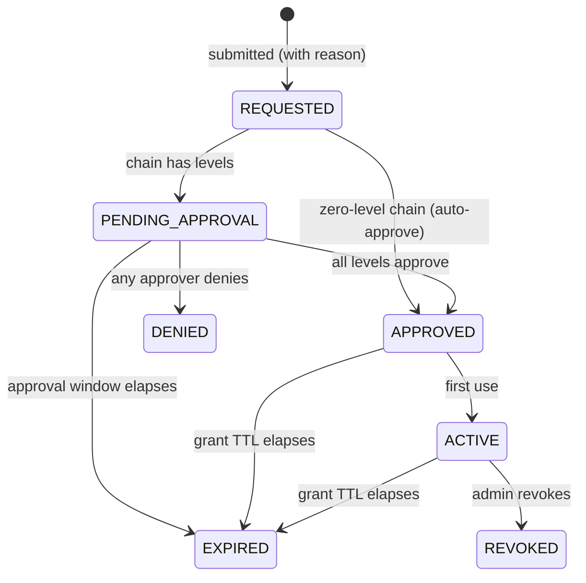

# JIT access

Just-in-time (JIT) access replaces standing privileges with **time-boxed
grants that someone else approves**. This guide shows you how to define what
is requestable, how the approval chain works, and how to revoke a grant —
including tearing down a session that is already live.

If you're the person *requesting* access, see
[Requesting access](../user-guide/requesting-access.md) instead.

## Prerequisites

- [ ] Data-plane basics in place: nodes labeled, [RBAC](rbac.md) understood.
- [ ] `settings:write` to create JIT policies, `request:approve` to
      approve/deny/revoke. Examples use a bearer token in `$TOKEN`
      ([Authentication](authentication.md)).

## Define what is requestable: JIT policies

A JIT policy scopes requests — which nodes, which capabilities, how long, and
who must approve:

```bash
curl -s https://cp.example.com/v1/jit-policies \
  -H "Authorization: Bearer $TOKEN" \
  -H "Content-Type: application/json" \
  -H "Idempotency-Key: jitpol-prod-web-1" \
  -d '{
    "name": "prod-web-emergency",
    "targetSelector": { "env": { "op": "eq", "value": "prod" }, "role": { "op": "eq", "value": "web" } },
    "capabilities": ["shell", "exec"],
    "maxTtlSeconds": 3600,
    "approvalChain": [
      { "kind": "oidc_group", "value": "sre-oncall" },
      { "kind": "email", "value": "alice@example.com" }
    ]
  }'
```

The approval chain is **0 to 3 levels**; each level is satisfiable by a named
email identity or by any member of an SSO/OIDC group. A zero-level chain
auto-approves — useful for low-risk targets where you want the time-box and
the audit trail without a human gate.

## The request lifecycle



Two independent clocks govern it:

- The **approval window** (default 30 minutes): the request must collect all
  approvals before it elapses, or it expires. A late approval cannot
  resurrect it.
- The **grant TTL**: starts at final approval, capped at
  `min(policy maxTtlSeconds, 8 hours)`. The policy's cap is snapshotted at
  submit time, so editing or deleting the policy later never widens an
  in-flight request.

Every transition — request, each approval, denial, expiry, activation,
revocation, and every rejected attempt — lands in the correlated
[audit stream](audit.md).

## Approving and denying

Pending requests are visible in the Dashboard's JIT screen and via the API:

```bash
curl -s "https://cp.example.com/v1/jit-requests?state=PENDING_APPROVAL" \
  -H "Authorization: Bearer $TOKEN"

# REQUEST_ID is the id of the pending request from the list above.
curl -s https://cp.example.com/v1/jit-requests/$REQUEST_ID/approve \
  -H "Authorization: Bearer $TOKEN" \
  -H "Content-Type: application/json" \
  -d '{ "reason": "change window CH-5678" }'
```

Approval rules, enforced as hard server-side invariants:

- **Self-approval is impossible.** The approver can never be the requester —
  checked before any level match, so no chain configuration, group
  membership, or ordering trick lets someone approve their own request.
- **One approver, one act.** An approver may act at most once per request, so
  a two-level chain requires two distinct humans.
- Approvers need the `request:approve` platform permission *and* must match
  the pending level (be the named email, or belong to the named group).

Denial (`POST .../deny`) is terminal. The requester sees the state change;
they do not learn which approver denied unless you tell them — the reason
field is for the audit trail.

## What an approved grant actually is

An approved request becomes a time-boxed allow that flows through the **same
deny-overrides engine** as standing rules — as a second pass, only when
standing rules alone found no allow. That design has two consequences worth
knowing:

- A JIT grant can never override an explicit deny rule or a
  [lock](locks.md). "Approved" does not beat "denied" — a locked target
  refuses a JIT session even with a fresh approval in hand, and this holds
  even for zero-level auto-approved chains.
- The session's `grant_expiry` is the minimum of the remaining grant TTL and
  the credential TTL, and the Gateway enforces it mid-session per the access
  model's expiry mode — an approved hour means an hour.

## Revoking a live grant

```bash
curl -s https://cp.example.com/v1/jit-requests/$REQUEST_ID/revoke \
  -H "Authorization: Bearer $TOKEN" \
  -H "Content-Type: application/json" \
  -d '{ "reason": "change aborted" }'
```

Revocation flips the request to `REVOKED` (blocking any new session) **and**
pushes a short-lived lock scoped to the grantee's identity, which tears down
the live session on every Gateway — fail-closed, within the lock
propagation window (lock TTL default 120 seconds,
`sessionlayer.jit.revoke-lock-ttl`).

> **Note:** because the teardown lock is identity-scoped, the revoked user's
> *other* live sessions are also interrupted during that short window. That
> is the deliberate trade — teardown must not depend on per-session state
> that a Gateway might not have.

## Next

- [Break-glass access](break-glass.md) — when there is no time for an
  approval chain.
- [Locks](locks.md) — the mechanism revocation rides on.
- [Requesting access](../user-guide/requesting-access.md) — the requester's
  side of this flow.
- [Audit](audit.md) — reconstructing approve → connect → run for any grant.
