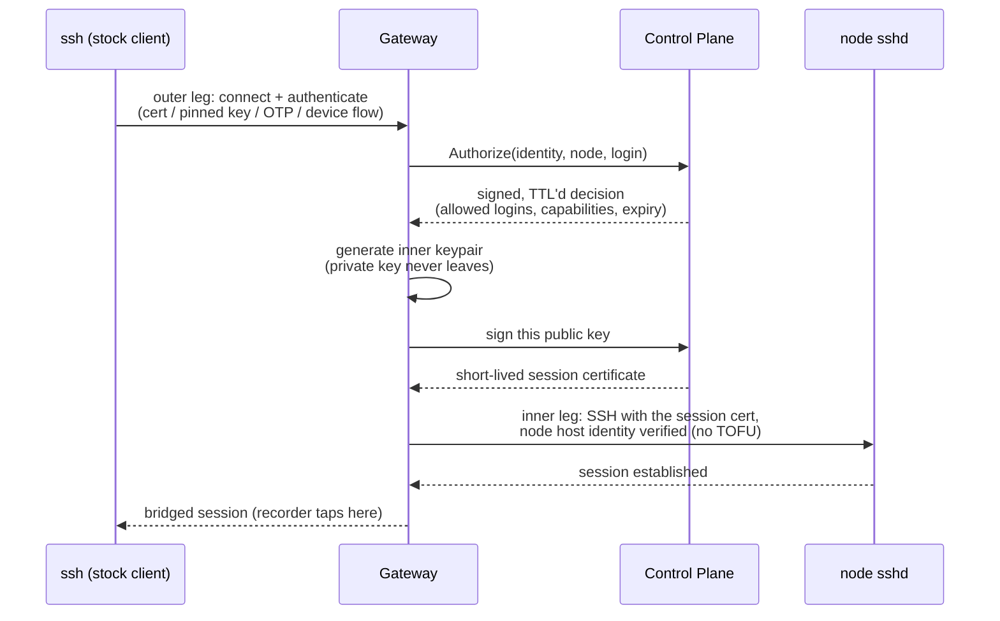

# Core concepts

This page gives you the mental model for SessionLayer and defines the terms the
rest of the documentation uses. Ten minutes here makes every other page faster
to read.

## The three components

SessionLayer is a self-hosted platform that puts a controlled, recorded front
door in front of the SSH access to a fleet of Linux hosts, usable from stock
OpenSSH clients — no custom client software.

| Component | What it is | Sees session plaintext? |
|---|---|---|
| **Control Plane** | The management service (Java). It decides — authentication, RBAC, certificate signing, inventory, audit — and serves the REST API and the Dashboard. | No |
| **Gateway** | The data-plane proxy (Rust). Users connect to it with `ssh`; it terminates the connection, asks the Control Plane for a decision, opens a second SSH connection to the node, and bridges the two. It records every session. | **Yes — the only component that does** |
| **Agent** | An optional, minimal per-node connector (Rust) for nodes that cannot accept inbound connections. It dials out to the Gateway; nothing ever dials in to it. | No |

A **node** is a Linux host you reach through SessionLayer. Nodes run their
ordinary `sshd` — the platform never replaces or disturbs it, so your existing
native SSH or console access remains an independent recovery path.

A **session** is one recorded SSH connection through a Gateway. Your `ssh`
connection to the Gateway is the *outer leg*; the Gateway's own SSH connection
to the node is the *inner leg*.

## A session's path

The recorder sits on the Gateway at the bridge, where the two legs meet. That
placement is the entire reason the platform is built as a terminating proxy: a
pure jump host sees only ciphertext and can never give you session recording or
file-transfer audit.

## Certificates, not keys

There are no long-lived SSH keys anywhere in the access path. Every session
runs on a fresh, short-lived certificate (a TTL of about five minutes, sized to
the handshake) minted only after policy passes. Revocation is therefore the
default state of the world: access that isn't re-granted simply expires.

Three certificate authorities with distinct jobs make this safe — the platform
calls them the **session CA**, the **user CA**, and the **host CA**:

- The **session CA** signs the inner-leg certificate the node accepts. A node's
  `sshd` trusts *only* this CA (one `TrustedUserCAKeys` line).
- The **user CA** optionally signs outer-leg user certificates (the Vault
  user-cert path) that authenticate you *to the Gateway*.
- The **host CA** signs node host certificates and the Gateway's own host
  certificate, so hosts are verified cryptographically — never
  trust-on-first-use.

The separation is the security crux: nothing you hold — user certificate,
pinned key, OTP — is ever accepted by a node directly. Only the Gateway can
mint what a node accepts, and it does so per connection, only after
re-evaluating authorization. A stolen user credential is useless against a
node's `sshd`.

The inner-leg certificate's key id embeds `session_id + identity`, so the
node's own `sshd` log records *who* was behind a shared login like `deploy` —
a second, node-local audit trail independent of the platform.

## Authorization: deny wins

Two separate RBAC systems govern the platform, and they share no rules:

- **data-plane RBAC** — who may SSH where, as which Linux login, with which
  capabilities (shell, exec, SFTP, SCP, port forwarding — each individually
  grantable, default `shell`+`exec` only).
- **platform RBAC** — who may administer SessionLayer itself (edit rules,
  enroll nodes, replay recordings, read audit).

Data-plane decisions are default-deny and **deny-overrides**: the result is a
pure function of the whole rule set, so no rule ordering can widen access. On
top of ordinary denies sits the **lock** — an un-overridable deny attached to
an identity, node, or session. A lock blocks new sessions, and it tears down
matching live sessions mid-flight.

Locks obey the platform's one asymmetric rule: *allow may fail open, deny must
fail closed, and deny wins*. Locks are actively pushed to every Gateway, and a
Gateway that cannot confirm its lock feed is healthy stops trusting cached
allow decisions — so an outage can never turn into a bypass.

## Access models

Every session is tagged with one of three **access models**:

- **standing** — a persistent RBAC grant. You have access until an admin
  changes the rules.
- **JIT** (just-in-time) — you request access to a node with a reason; a
  configurable approval chain (zero to three levels) approves it; a time-boxed
  grant follows. Self-approval is impossible by construction. See
  [Requesting access](../user-guide/requesting-access.md).
- **break-glass** — an emergency path for when the identity provider is down.
  It authenticates independently of your IdP (FIDO2 hardware keys, or
  pre-issued offline codes), fires an alert on every use, forces strict
  recording, and requires post-hoc review. It cannot override a lock.

## Recording

Every session is recorded — terminal output *and* keystrokes — in the standard
asciicast v2 format. File transfers are audited by protocol decoding: names,
sizes, and content hashes, never file content (see
[File transfer](../user-guide/file-transfer.md)).

Recordings are sealed to the **customer recording key**: an encryption key pair
whose private half only you, the operator, hold. The Control Plane stores only
the public half, so *the platform cannot decrypt its own recordings* — a
compromised Control Plane or a malicious platform admin reads ciphertext.
Sealed objects land in a WORM (write-once) object store with a hash chain for
tamper evidence.

## What "zero-trust SSH" honestly means here

Zero trust describes the access-decision model: no network location is trusted,
every session re-authenticates and re-authorizes, and all access is short-lived
and recorded. It does not mean trust has been eliminated. The Gateway and the
CAs are a fully-trusted **Tier-0** component that sees session plaintext — the
model *relocates* trust from long-lived keys scattered across a fleet into one
audited, hardened, short-lived-cert control point.

If your threat model rejects any plaintext-visible intermediary, use end-to-end
SSH and accept the loss of recording and file-transfer audit; that trade-off is
real, and SessionLayer takes the recording side of it. The
[trust model](../security/trust-model.md) page states exactly what the platform
does and does not protect against.

## Term reference

| Term | Meaning |
|---|---|
| node | a Linux host you reach through SessionLayer |
| session | one recorded SSH connection through a Gateway |
| access model | how a session was authorized: standing, JIT, or break-glass |
| lock | the un-overridable deny primitive; tears down live sessions |
| recording | the sealed asciicast of a session |
| lease | a live session's slot against a session limit |
| session CA / user CA / host CA | the three certificate authorities, per the table above |
| join token | the single-use credential that enrolls an Agent or Gateway |
| customer recording key | the operator-held key recordings are sealed to |
| data-plane RBAC / platform RBAC | who may SSH where / who may administer SessionLayer |

The [Glossary](../reference/glossary.md) carries the full list.

## Next

- [Quickstart](quickstart.md) — see all of this run on your machine in ~20 minutes.
- [How SessionLayer compares](how-it-compares.md) — what it does and deliberately does not do.
- [SSH access](../user-guide/ssh-access.md) — connect with your stock OpenSSH client.
- [Trust model](../security/trust-model.md) — the threat model, stated plainly.
