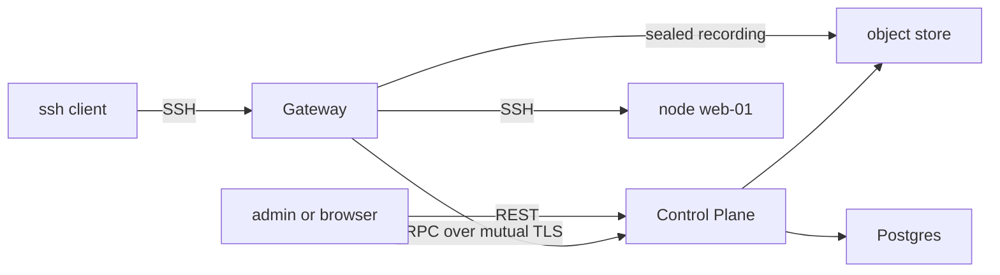
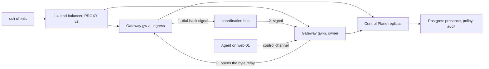
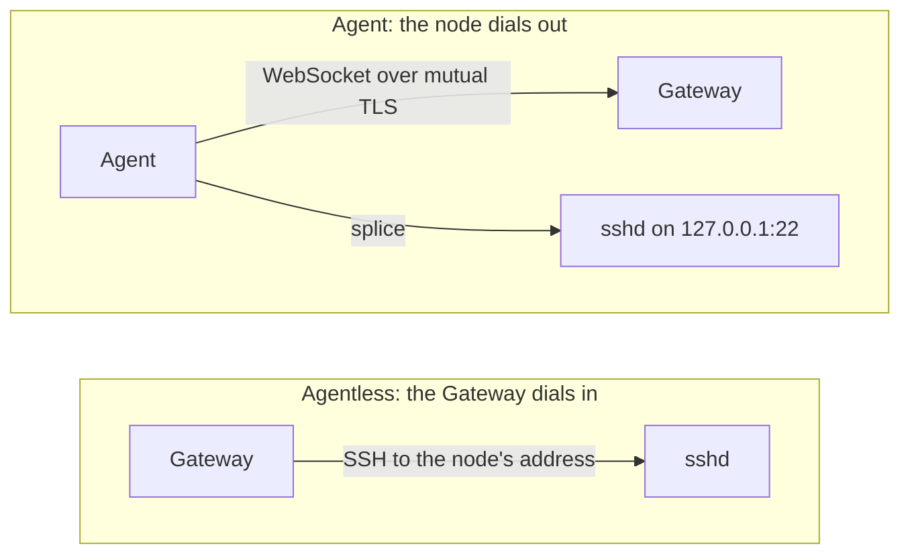

# Deployment topology

Which side opens the TCP connection to each node is the decision that survives
contact with a network team, and SessionLayer lets you make it per node: the
Gateway dials the node, or the node's Agent dials out to the Gateway. Around
that sit two sizing decisions, how many Gateways carry sessions and whether the
Control Plane runs as one process or several, which together set your failure
domains.

Ports, protocols and the configuration key that moves each listener are in
[Ports](../reference/ports.md). What follows is the shape around them: who
dials whom, and which arrangement needs which flow.

## Single-node evaluation

Everything on one host, one Gateway, one Control Plane, no coordination bus.
The [Quickstart](../getting-started/quickstart.md) stack is exactly this
shape: Postgres, a MinIO WORM store, the Control Plane, one Gateway, one
agentless node, and a container standing in for a workstation.

Arrows point the way connections are established, which is the property a
firewall rule cares about. Only two of them cross the host boundary: a user's
`ssh` to the Gateway, and an admin's REST call to the Control Plane. The
Gateway and the Control Plane initiate everything else themselves.

The quickstart publishes three ports on `127.0.0.1` and nothing else: the
Control Plane's REST API on `8080`, the Gateway's SSH front door on `2222`,
and the object store on `9000` so a signed replay URL resolves from your
browser. The Control Plane's gRPC plane stays inside the Compose network,
where the Gateway is its only client. `ha.mode` is `single_instance`, so no
presence heartbeat, no bus, and no peer relay run at all.

The stack runs no Dashboard, which changes the picture less than it looks. The
Dashboard is a static browser bundle: it adds a file host, and the browser then
calls the same REST API an admin would call with `curl`. It is never a hop in
front of the Control Plane.

> **Warning:** a single-node deployment has one failure domain. One kernel,
> one disk, one restart: losing the host ends every live session and every
> path to the audit trail at the same instant. The quickstart stack also
> relaxes CA key custody, credentials, and recorder TLS for a throwaway
> evaluation. See [Production hardening](../security/hardening.md).

## Single-region HA

Several Gateways behind an L4 load balancer, several Control Plane replicas
behind an L7 balancer, and one Postgres that both tiers treat as the source
of truth. Set `ha.mode` to `ha` on every Gateway.

What multiplies is the Gateway tier and the Control Plane tier. The Control
Plane replicas are stateless except for Postgres, and Postgres itself does not
multiply: it stays the arbiter of which Gateway owns each agent node, in both
modes. The coordination bus is added, and it carries signals only.

The three numbered arrows are one session landing on the wrong Gateway. The
load balancer hands the client to `gw-a`, but `gw-b` owns the Agent's control
channel. `gw-a` publishes a dial-back signal on the bus; `gw-b` receives it and
opens a direct TLS connection back to `gw-a` on the `/peer/v1/relay` path of its
agent transport listener. Session bytes then flow client → `gw-a` → `gw-b` →
node.

Two consequences operators consistently get backwards:

- The owner dials the ingress, not the reverse. The signal advertises the
  ingress Gateway's relay address (`ha.peer_relay_advertise_addr`, which
  defaults to the agent transport's advertise URL), and the owner is the party
  that opens the socket. Because any Gateway can be ingress for any session,
  the firewall rule is mutual: allow every Gateway to reach every other
  Gateway's agent transport port.
- The relay exists only for agent nodes. An agentless node is reachable by
  any Gateway directly, so whichever Gateway took the session dials the node
  itself, with no presence, no signal and no relay involved.

The mechanism behind those arrows belongs to
[High availability](../admin-guides/high-availability.md): what presence
records and how ownership fails over, why session bytes never traverse the bus,
why the ingress Gateway stays the session's recorder, how a Gateway drains and
what that means for your health check, and the two Control Plane preconditions,
a shared OIDC state key and Postgres replication.

> **Warning:** the built-in coordination client connects in plaintext with no
> authentication, targeting a trusted internal network. Put a TLS-terminating
> sidecar or a NATS leaf-node boundary in front of the broker, with subject
> authorization so only a node's owner can subscribe to its dial-back subject.

The load balancer in front of the Gateways must speak PROXY protocol v2, and
`ssh.proxy.lb_cidrs` must list it. That pairing fails closed in both
directions: a missing or malformed header from a trusted CIDR is rejected, and
so is a connection from a peer outside it. Without it, every session's source
IP is the balancer's, and source-IP policy stops meaning anything.

## Agentless and agent nodes

Per node, one of two connection directions. This is independent of the other
two choices: a single-node evaluation can run agent nodes, and an HA fleet can
be entirely agentless.

Agentless nodes install nothing. You register an address and pin the node's
host key, and the Gateway opens an ordinary SSH connection to it, presenting a
short-lived certificate the node's `sshd` already trusts. The node needs
inbound `22` from every Gateway that might serve it, which in HA means all of
them.

Agent nodes need no inbound rule at all. The Agent dials out to the agent
transport and holds a control channel open. For each session the Gateway sends
a dial-back request down that channel, the Agent opens a second outbound
connection, and splices it to the node's own `sshd` over loopback. The Gateway
never reaches the node's loopback; that is the point of the model.
The Agent's local dial is restricted to loopback and that restriction is
enforced, so the Agent is not a pivot into the node's network.

Choose the Agent for nodes behind NAT or an egress-only firewall, or where you
want the node-local second audit trail; choose agentless everywhere else,
because there is no software to install, verify or upgrade. See
[Nodes](../admin-guides/nodes.md) for the per-node decision and
[Install the Agent](../installation/agent.md) for the join.

Two startup behaviors make the choice explicit rather than silent. A node
registered as an agent node on a Gateway whose agent transport is disabled is
offline, never a quiet fallback to an agentless dial. And a Gateway with a
wildcard agent transport `listen_addr` and no advertise URL refuses to boot,
because Agents would otherwise be told to dial back to `0.0.0.0`. In HA, give
each Agent two or more Gateway endpoints in different failure domains; it
holds a channel to each and survives losing one.

## Connection matrix

Direction, initiator and authentication for each flow, and which arrangement
needs it. Ports and the configuration key for each listener are in
[Ports](../reference/ports.md), which is the authority on both; this table adds
who dials and when you need the rule.

| Initiator dials listener | Authenticated by | Needed in |
|---|---|---|
| `ssh` client → Gateway SSH front door | SSH user auth: certificate, pinned key, OTP or device flow, behind a source-IP gate applied before the banner | every deployment |
| L4 load balancer → Gateway SSH front door | PROXY v2 header from a CIDR in `ssh.proxy.lb_cidrs`; missing header or untrusted peer rejected | any deployment behind a balancer |
| Load balancer → Gateway `/readyz` | none; expose it only on the balancer's network | any deployment whose scheduler probes readiness, including the shipped Kubernetes manifest |
| Gateway → Control Plane gRPC | mutual TLS 1.3 on a renewable internal-CA identity with a generation counter | every deployment |
| Gateway → node `sshd` | a short-lived session certificate; the node's presented host identity must match its enrolled pin, with no trust on first use | agentless nodes |
| Gateway → object store | a short-lived credential the Control Plane presigns per upload; bytes never proxy through the Control Plane | every deployment |
| Agent → Control Plane gRPC | mutual TLS 1.3, bootstrapped by a join token, an OIDC workload identity or an operator-PKI certificate | agent nodes |
| Agent → Gateway agent transport | mutual TLS 1.3 with a client certificate required, lock-gated at registration and at every dial-back | agent nodes |
| Agent → `127.0.0.1:22` | the session certificate the node's `sshd` trusts; the dial is loopback-only and enforced | agent nodes |
| owner Gateway → ingress Gateway `/peer/v1/relay` | mutual TLS 1.3 plus a single-use token bound to node, session, gateway, principal and expiry | HA, agent nodes only |
| Gateway → coordination bus | none from the built-in client; supply TLS and subject authorization at the broker | HA |
| Control Plane → object store | your object-store credentials | every deployment; presigns upload, replay and export URLs, and runs retention |
| Control Plane → Azure Key Vault | your Key Vault credentials | any deployment that has adopted `azure_keyvault` for a SSH CA; see [Certificate authorities](../admin-guides/certificate-authorities.md#adopt-key-vault-for-a-ca) |
| Control Plane → AWS KMS | whatever the standard AWS credential chain resolves (IRSA, an instance profile, a profile) | any deployment that has adopted `aws_kms` for a SSH CA; see [Certificate authorities](../admin-guides/certificate-authorities.md#adopt-aws-kms-for-a-ca) |
| Control Plane → Postgres | your database credentials | every deployment |
| Control Plane → your IdP | your OIDC client credentials | every deployment using OIDC login |
| browser → Control Plane REST API | OIDC auth-code with PKCE, then a bearer token | every deployment |
| browser → object store | a signed URL scoped to one object; the recording is decrypted in the browser with the customer recording key | every deployment |
| Control Plane, Gateway, Agent → OTLP collector | whatever your collector requires | any deployment exporting traces or metrics |

Nothing in this matrix lets a user's credential reach a node. Every session
transits a Gateway, and only a Gateway can mint what a node's `sshd` accepts.
Whether you keep a direct native-SSH path open alongside the platform is a
separate recovery decision, covered in
[Break-glass access](../admin-guides/break-glass.md).

## Next

- [Ports](../reference/ports.md): every listener and dial, with its port and
  the key that moves it.
- [High availability](../admin-guides/high-availability.md): ownership,
  failover and draining in the HA shape.
- [Nodes](../admin-guides/nodes.md): choosing agent or agentless per node.
- [Production hardening](../security/hardening.md): the preconditions each
  shape assumes.
